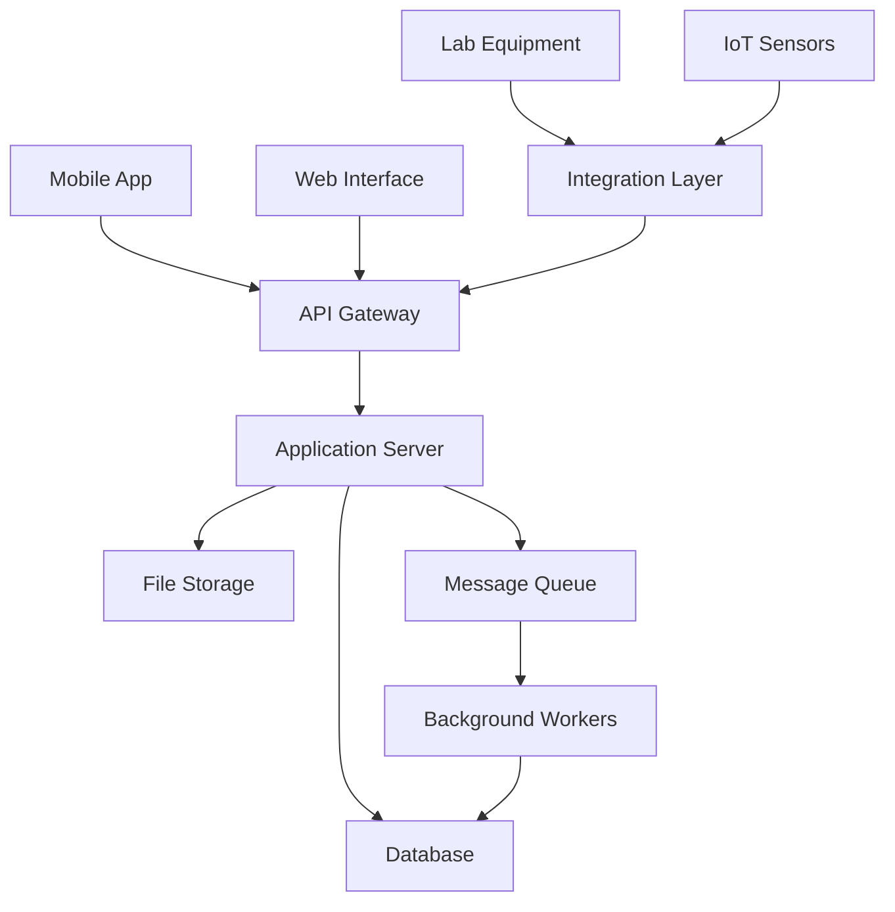
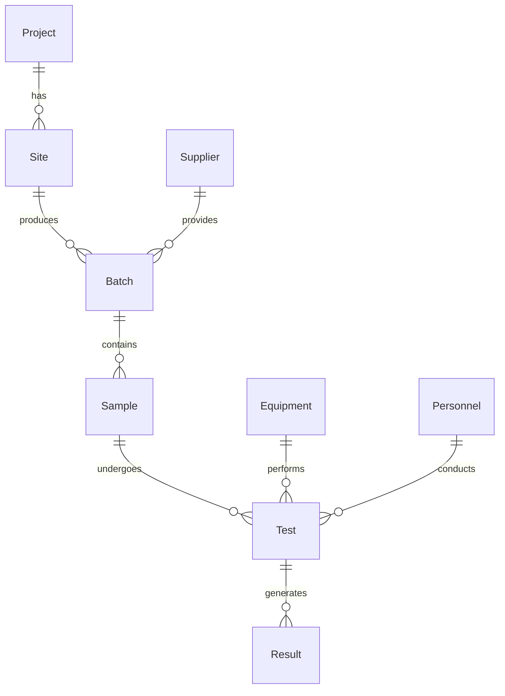

# Concrete Quality Control System Documentation
## Brazilian Civil Engineering Implementation Guide

### Document Control
- Version: 1.0
- Date: November 2024
- Status: Draft
- Classification: Technical Documentation

## 1. Problem Statement

### 1.1 Current Industry Challenges

The Brazilian construction industry faces significant challenges in concrete quality control, impacting project outcomes and compliance:

#### Statistical Impact
- 23% of structural concrete defects are attributed to quality control failures
- Financial impact estimated at 3.5% of total construction costs
- 40% increase in rework due to inadequate quality tracking
- 65% of projects report delays due to concrete-related issues

#### Compliance Requirements
- NBR 12655:2022 - Concrete preparation, control, receipt, and acceptance
- NBR 6118:2014 - Design of concrete structures
- NBR 14931:2004 - Execution of concrete structures

#### Current Process Pain Points
1. Manual data collection and transcription errors
2. Delayed test result availability
3. Inconsistent sampling procedures
4. Limited traceability of concrete batches
5. Difficulty in regulatory compliance documentation
6. Inefficient communication between laboratory and construction site

### 1.2 Traceability Gaps
- Incomplete chain of custody documentation
- Limited ability to track samples from collection to testing
- Poor correlation between test results and placement location
- Inadequate supplier quality tracking

## 2. Solution Overview

### 2.1 System Purpose
The Concrete Quality Control (CQC) system provides an integrated platform for managing all aspects of concrete quality control in construction projects, ensuring compliance with Brazilian technical standards while optimizing workflows and reducing errors.

### 2.2 Core Features

#### Sample Management
- Automated sample identification and tracking
- QR code integration for sample identification
- Mobile app for field collection data
- Real-time sample status monitoring

#### Testing Management
- Integration with laboratory equipment
- Automated result calculation and validation
- Statistical process control (SPC) analysis
- Test scheduling and notification system

#### Compliance Management
- NBR standards compliance checking
- Automated non-conformity detection
- Regulatory report generation
- Audit trail maintenance

#### Integration Capabilities
- Laboratory Information Management System (LIMS)
- Construction ERP systems
- Project management software
- Mobile data collection
- IoT sensors and testing equipment

## 3. Value Proposition

### 3.1 Quantifiable Benefits

#### Time Savings
- 75% reduction in data entry time
- 60% faster test result availability
- 40% reduction in report generation time
- 50% decrease in audit preparation time

#### Cost Reduction
- 30% reduction in rework costs
- 25% decrease in quality control staff hours
- 45% reduction in documentation costs
- 20% savings in material waste

#### Quality Improvements
- 80% reduction in data entry errors
- 95% improvement in traceability
- 70% faster non-conformity detection
- 100% compliance documentation coverage

### 3.2 ROI Calculation

```
ROI = [(Annual Benefits - Annual Costs) / Implementation Costs] × 100

Annual Benefits:
- Reduced labor costs: R$ 120,000
- Avoided rework: R$ 250,000
- Improved efficiency: R$ 180,000
- Reduced material waste: R$ 150,000

Implementation Costs:
- Software license: R$ 200,000
- Hardware: R$ 100,000
- Training: R$ 50,000
- Integration: R$ 100,000

First Year ROI = 55%
Three Year ROI = 165%
```

## 4. Technical Specifications

### 4.1 System Architecture

#### High-Level Architecture


#### Deployment Model
- Primary: Cloud-based (Azure Brazil South)
- Secondary: Edge servers at construction sites
- Hybrid capability for remote locations

#### Security Measures
- Role-based access control (RBAC)
- End-to-end encryption
- Multi-factor authentication
- Data encryption at rest
- Audit logging

### 4.2 Data Model

#### Core Entities



#### Data Validation Rules
1. Sample identification must follow NBR 12655 format
2. Test results must include uncertainty measurements
3. Batch tracking requires supplier certification
4. Equipment calibration status verification
5. Personnel qualification validation

## 5. Implementation Guidelines

### 5.1 System Requirements

#### Server Requirements
- CPU: 8+ cores
- RAM: 32GB minimum
- Storage: 1TB SSD
- OS: Ubuntu Server 22.04 LTS

#### Client Requirements
- Modern web browser
- Android 10+ / iOS 13+ for mobile
- Minimum 10Mbps internet connection
- PDF reader for reports

### 5.2 Installation Steps
1. Database setup and migration
2. Application server deployment
3. Integration layer configuration
4. Mobile app distribution
5. User account provisioning
6. Initial system configuration
7. Test environment validation

## 6. Quality Assurance

### 6.1 Testing Strategy

#### Automated Testing
- Unit tests for core calculations
- Integration tests for equipment interfaces
- Load testing for concurrent users
- API endpoint testing
- Mobile app testing

#### Manual Testing
- User acceptance testing
- Workflow validation
- Report generation verification
- Compliance checking
- Security assessment

### 6.2 Performance Metrics
- Response time < 2 seconds
- 99.9% uptime
- < 0.1% data error rate
- < 5 minute recovery time
- 100% test result traceability

## 7. Compliance and Standards

### 7.1 Brazilian Standards
- NBR 12655:2022 compliance
- NBR 6118:2014 calculations
- NBR 14931:2004 procedures
- ABNT NBR ISO/IEC 17025:2017

### 7.2 Data Privacy (LGPD)
- Data classification
- Retention policies
- Access controls
- Privacy impact assessment
- Data subject rights management

## 8. User Interface

### 8.1 Design Guidelines
- Material Design principles
- WCAG 2.1 compliance
- Portuguese (Brazil) localization
- Responsive design
- Offline capability

### 8.2 Mobile Interface
- Native Android/iOS apps
- Offline data collection
- Photo documentation
- GPS location tracking
- QR code scanning

## 9. Business Continuity

### 9.1 Backup Procedures
- Hourly incremental backups
- Daily full backups
- Weekly off-site replication
- Monthly archive storage
- 7-year data retention

### 9.2 Disaster Recovery
- RTO: 4 hours
- RPO: 1 hour
- Automated failover
- Geographic redundancy
- Regular DR testing

## 10. Support and Maintenance

### 10.1 Support Levels
- L1: Basic user support
- L2: Technical support
- L3: Development support
- 24/7 emergency support
- On-site support available

### 10.2 Maintenance Schedule
- Weekly patches
- Monthly updates
- Quarterly major releases
- Annual security audit
- Continuous monitoring
