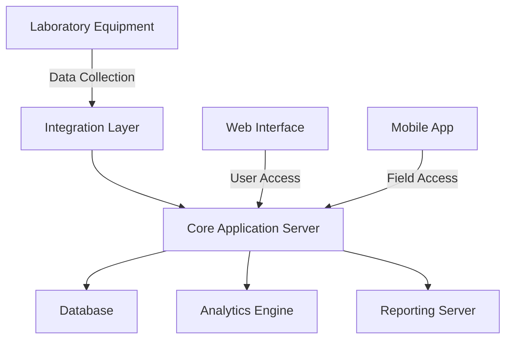
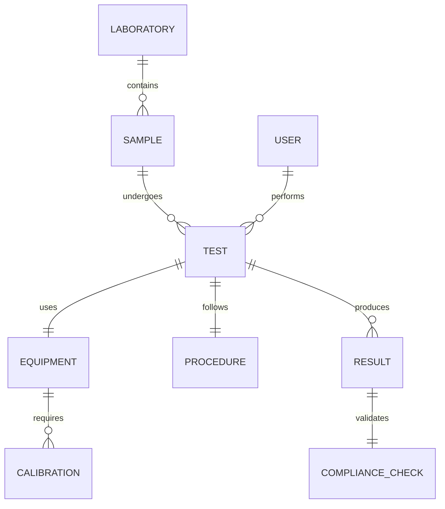

# Concrete Quality Control System Documentation
For Brazilian Laboratories

## 1. Context and Problem Statement

### Current Challenges
Brazilian concrete testing laboratories face several critical challenges in maintaining quality control while adhering to NBR standards:

- Manual documentation processes lead to transcription errors and data inconsistencies
- Difficulty in maintaining real-time compliance with evolving NBR standards
- Limited traceability in sample handling and test procedures
- Inefficient workflow management across multiple testing stations
- Inconsistent reporting formats between different laboratory locations

### Specific NBR Standards Coverage
The system addresses requirements from key NBR standards:

- NBR 12655:2022 - Concrete preparation, control, receipt, and acceptance
- NBR 5738:2015 - Concrete test specimens preparation and curing procedures
- NBR 5739:2018 - Compressive strength testing of cylindrical specimens
- NBR 7212:2012 - Ready-mixed concrete execution
- NBR 14931:2004 - Cast-in-place concrete execution procedures

### Market Needs
Current laboratory workflows demonstrate inefficiencies in:
- Sample tracking and identification
- Equipment calibration management
- Test result documentation
- Compliance verification
- Report generation and distribution

## 2. Solution Overview

### Primary Objectives
1. Automate concrete testing workflows while ensuring NBR compliance
2. Provide real-time data collection and analysis
3. Ensure complete traceability of samples and tests
4. Generate standardized, compliance-ready documentation
5. Integrate with existing laboratory equipment

### Key Features
- Digital sample registration and tracking
- Automated test procedure workflows
- Real-time data collection from testing equipment
- Integrated compliance checking
- Automated report generation
- Quality control dashboards
- Equipment calibration management
- User role-based access control

### Compliance Measures
- Built-in NBR standard requirements
- Automated compliance checking
- Digital signature support
- Audit trail generation
- Version control for procedures and documentation

## 3. Value Proposition

### Quantifiable Benefits

#### Cost Reduction
- 40% reduction in documentation time
- 60% reduction in compliance-related rework
- 30% reduction in paper-based documentation costs

#### Quality Improvements
- 99.9% data accuracy through automated collection
- 100% traceability of samples and tests
- 50% reduction in non-conformance incidents

#### Time Savings
- 70% faster report generation
- 80% reduction in data entry time
- 50% faster audit preparation

## 4. Technical Architecture

### System Architecture

### Technology Stack
- Backend: Java Spring Boot
- Frontend: React
- Database: PostgreSQL
- Analytics: Python with NumPy/Pandas
- API: REST with OpenAPI specification
- Mobile: React Native

### Security Measures
- Role-based access control
- Data encryption at rest and in transit
- Digital signatures for test results
- Audit logging
- Two-factor authentication for critical operations

## 5. Data Model

### Core Entities Relationship Diagram

### Data Validation Rules
1. Sample identification must follow NBR 12655 format
2. Test results must fall within specified ranges per NBR standards
3. Equipment calibration status must be current
4. All critical operations require digital signatures
5. Test procedures must match NBR specifications

## 6. Core Entities

### Laboratory Information
- Registration number
- INMETRO certification details
- Equipment inventory
- Staff qualifications
- Operating procedures
- Quality certifications

### Test Samples
- Unique identifier
- Collection date/time
- Source information
- Physical characteristics
- Storage conditions
- Chain of custody

### Testing Equipment
- Equipment ID
- Type and model
- Calibration history
- Maintenance schedule
- Operating parameters
- Verification status

## 7. Business Rules

### NBR Compliance Rules
1. Sample preparation must follow NBR 5738
2. Compression testing must adhere to NBR 5739
3. Result validation must meet NBR 12655 criteria
4. Documentation must maintain NBR 14931 standards

### Testing Workflows
1. Sample registration and identification
2. Test procedure selection
3. Equipment verification
4. Test execution
5. Result recording
6. Compliance verification
7. Report generation

## 8. User Interface Requirements

### Dashboard Components
- Active tests status
- Equipment calibration alerts
- Compliance indicators
- Recent test results
- Pending approvals
- Quality metrics

### Mobile Requirements
- Sample registration
- Test result entry
- Equipment checks
- Photo documentation
- Digital signatures
- Report viewing

## 9. Integration Requirements

### Laboratory Equipment Integration
- Direct data collection from testing machines
- Calibration status monitoring
- Real-time measurement recording
- Error detection and alerting
- Results validation

### API Specifications
- RESTful endpoints for all core functions
- JSON data format
- OAuth2 authentication
- Rate limiting
- Versioning support

## 10. Quality Assurance

### Testing Procedures
- Automated test method validation
- Result verification against NBR standards
- Equipment calibration verification
- User qualification checking
- Documentation completeness verification

### Validation Protocols
1. Data entry validation
2. Result range checking
3. Procedure compliance verification
4. Documentation completeness
5. Digital signature verification

## 11. Reporting and Analytics

### Standard Reports
- Test certificates
- Compliance reports
- Equipment calibration records
- Quality control charts
- Audit trails
- Performance analytics

### Analytics Capabilities
- Trend analysis
- Quality metrics
- Performance indicators
- Compliance statistics
- Resource utilization
- Cost analysis

## 12. Security and Compliance

### Access Control
- Role-based permissions
- Multi-factor authentication
- Session management
- Activity logging
- IP restrictions

### Data Privacy
- Encryption at rest
- Secure transmission
- Data masking
- Retention policies
- Access auditing

## 13. Implementation Guidelines

### Deployment Strategy
1. Infrastructure setup
2. Database migration
3. User training
4. Equipment integration
5. Pilot testing
6. Production rollout
7. Post-deployment monitoring

### Training Requirements
- System administration
- User operation
- Testing procedures
- Quality control
- Compliance management
- Report generation
- Troubleshooting

### Success Criteria
1. 100% NBR compliance
2. Zero data loss incidents
3. 99.9% system availability
4. Complete test traceability
5. Automated reporting capability
6. Full equipment integration
7. User adoption metrics

### Maintenance Protocols
- Daily backup verification
- Weekly system health checks
- Monthly performance review
- Quarterly security audits
- Annual disaster recovery testing

This documentation provides a comprehensive framework for implementing a Concrete Quality Control System in Brazilian laboratories while ensuring compliance with all relevant NBR standards. Regular updates will be made to reflect changes in standards and operational requirements.
