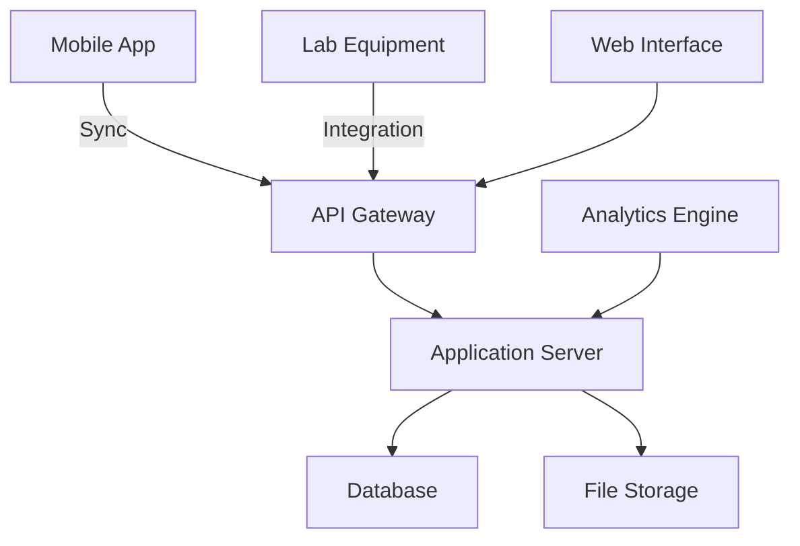
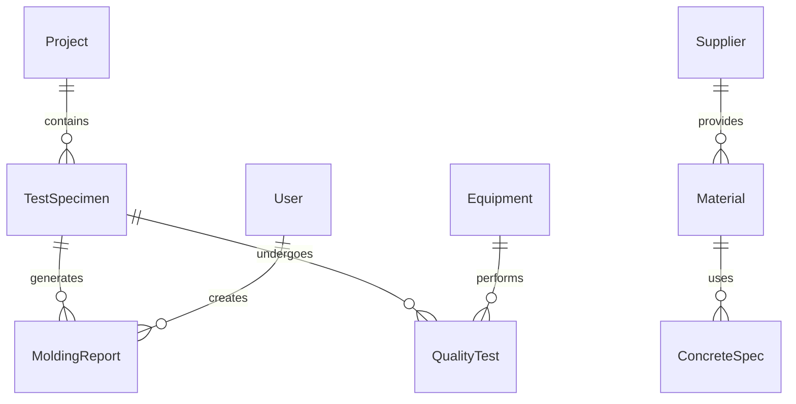

# Concrete Quality Control System
## Technical Documentation
Version 1.0 | November 2024

## Table of Contents
1. [Problem Statement](#problem-statement)
2. [Solution Overview](#solution-overview)
3. [Value Proposition](#value-proposition)
4. [Technical Specifications](#technical-specifications)
5. [Implementation Guidelines](#implementation-guidelines)
6. [Additional Considerations](#additional-considerations)

## Problem Statement

### Current Industry Challenges

#### Manual Process Limitations
- Inconsistent data collection across construction sites
- Time-consuming paper-based documentation
- High risk of data entry errors
- Difficulty in tracking specimen history
- Limited real-time visibility into quality control processes

#### Compliance Challenges
- Complex adherence requirements to Brazilian standards:
  - NBR 16886 (Concrete sampling procedures)
  - NBR 5738 (Molding and curing concrete test specimens)
  - NBR 7215 (Portland cement testing)
  - NBR 16868-2-Anexo A (Specimen specifications)
- Manual verification of compliance requirements
- Incomplete documentation of testing procedures
- Difficulty maintaining audit trails

#### Traceability Issues
- Limited ability to track specimens throughout their lifecycle
- Disconnected information between field and laboratory
- Inadequate chain of custody documentation
- Poor visibility into test specimen handling conditions

## Solution Overview

### Digital Quality Control Platform

#### Core Capabilities
1. **Digital Data Collection**
   - Mobile-first approach for field operations
   - Offline capability with synchronization
   - Automated form generation and validation
   - Digital signature capture
   - Photo documentation integration
   - GPS location tracking

2. **Workflow Management**
   - Configurable approval processes
   - Role-based access control
   - Automated notifications and alerts
   - Test scheduling and reminder system
   - Equipment calibration tracking

3. **Integration Framework**
   - Laboratory equipment data import
   - Environmental condition monitoring
   - Third-party system integration capabilities
   - Batch plant system connectivity
   - Material supplier integration

4. **Reporting and Analytics**
   - Real-time dashboards
   - Customizable report templates
   - Trend analysis tools
   - Compliance monitoring
   - Performance metrics tracking

## Value Proposition

### Quantifiable Benefits

#### Time Savings
- 75% reduction in report generation time
- 60% decrease in data entry efforts
- 40% faster test scheduling and coordination
- 50% reduction in compliance verification time

#### Quality Improvements
- 90% reduction in data entry errors
- 100% compliance with documentation requirements
- Real-time visibility into quality metrics
- Improved specimen tracking accuracy

#### Cost Reduction
- 30% decrease in administrative overhead
- 25% reduction in non-compliance incidents
- 20% improvement in resource utilization
- Eliminated paper-based storage costs

## Technical Specifications

### System Architecture

#### High-Level Architecture


### Data Model

#### Core Entities


#### Entity Specifications

1. **Project**
   ```json
   {
     "id": "UUID",
     "name": "string",
     "location": {
       "latitude": "decimal",
       "longitude": "decimal",
       "address": "string"
     },
     "client": "string",
     "startDate": "date",
     "endDate": "date",
     "status": "enum"
   }
   ```

2. **TestSpecimen**
   ```json
   {
     "id": "UUID",
     "projectId": "UUID",
     "specimenType": "enum",
     "dimensions": {
       "height": "decimal",
       "diameter": "decimal"
     },
     "strength": {
       "specified": "decimal",
       "achieved": "decimal"
     },
     "moldingDate": "datetime",
     "status": "enum",
     "location": "string"
   }
   ```

### Key Features Implementation

#### Test Specimen Molding Report Generator
```typescript
interface MoldingReport {
  operationalCode: string;
  interestedParty: string;
  arrivalTime: DateTime;
  departureTime: DateTime;
  moldingDate: Date;
  constructionSite: string;
  molders: string[];
  concreteSpec: {
    type: ConcreteType;
    mixLocation: MixLocation;
    strengthClass: number;
    brand: string;
    aggregateSpec: AggregateSpec[];
    additives: Additive[];
  };
  technicalParams: {
    specifiedSlump: number;
    cementConsumption: number;
    specimens: {
      dimensions: Dimensions;
      quantity: number;
    };
    weather: WeatherCondition;
    seriesNumber: string;
    invoiceNumber: string;
    concreteVolume: number;
    moldingTime: DateTime;
    slumpTestResults: SlumpTest[];
    placementLocation: string;
    testingSchedule: TestSchedule[];
  };
}
```

### Implementation Guidelines

#### Security Requirements
1. **Authentication**
   - OAuth 2.0 implementation
   - Multi-factor authentication
   - Role-based access control
   - Session management
   - API key management

2. **Data Protection**
   - End-to-end encryption
   - Secure data storage
   - Audit logging
   - Backup procedures
   - Data retention policies

#### Mobile Requirements
1. **Offline Capabilities**
   - Local data storage
   - Conflict resolution
   - Background synchronization
   - Queue management
   - Resource optimization

2. **Field Operations**
   - Camera integration
   - GPS tracking
   - Barcode scanning
   - Voice input
   - Digital signatures

## Additional Considerations

### Internationalization
- Multi-language support (Portuguese/English)
- Region-specific date formats
- Measurement unit conversion
- Currency handling
- Time zone management

### Integration Patterns
1. **REST APIs**
   ```yaml
   openapi: 3.0.0
   paths:
     /api/v1/specimens:
       post:
         summary: Create new test specimen
         requestBody:
           required: true
           content:
             application/json:
               schema:
                 $ref: '#/components/schemas/TestSpecimen'
         responses:
           201:
             description: Specimen created successfully
   ```

2. **Event-Driven Architecture**
   ```mermaid
   sequenceDiagram
       participant Mobile
       participant API
       participant EventBus
       participant Storage
       Mobile->>API: Create Specimen
       API->>EventBus: Specimen.Created
       EventBus->>Storage: Process Event
   ```

### Deployment Strategy
1. **Infrastructure**
   - Container orchestration (Kubernetes)
   - Cloud-native services
   - High availability setup
   - Disaster recovery
   - Performance monitoring

2. **CI/CD Pipeline**
   ```mermaid
   graph LR
       A[Code] -->|Build| B[Test]
       B -->|Quality Gate| C[Stage]
       C -->|Deploy| D[Production]
   ```

---

## Appendices

### A. Compliance Matrix
| Requirement | Standard | Implementation |
|------------|----------|----------------|
| Sampling | NBR 16886 | Digital workflow |
| Molding | NBR 5738 | Guided process |
| Testing | NBR 7215 | Automated validation |
| Specimens | NBR 16868-2 | Dimensional checks |

### B. API Documentation
Detailed API documentation available at `/api/docs`

### C. Database Schema
Complete database schema available in `/schema/concrete-qc.sql`

### D. User Interface Guidelines
UI/UX specifications available in `/docs/ui-guidelines.md`
